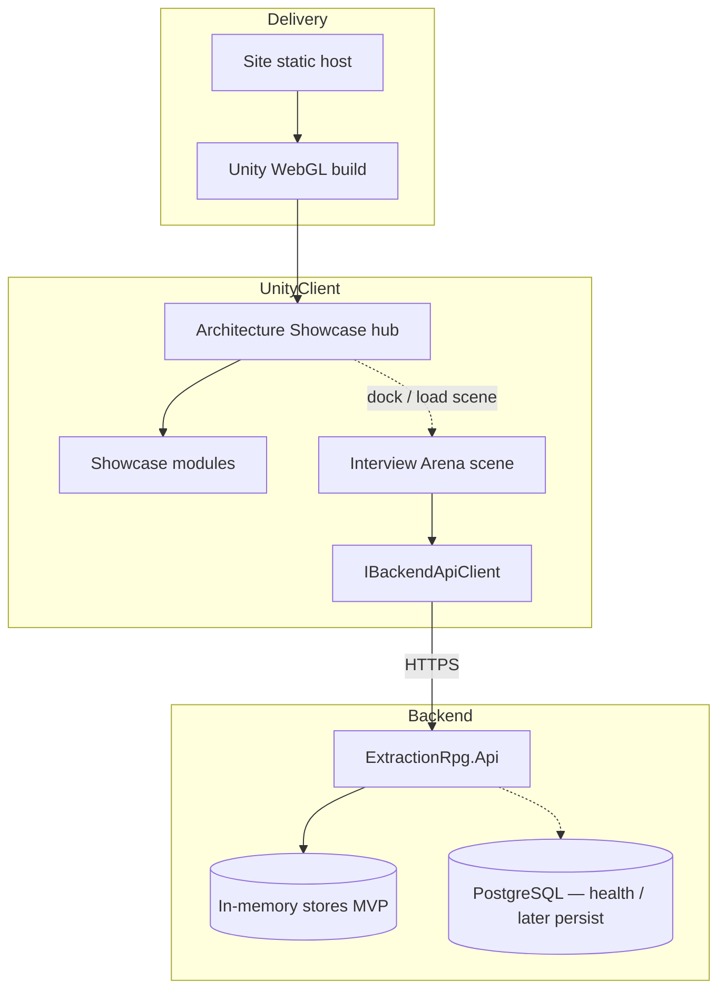
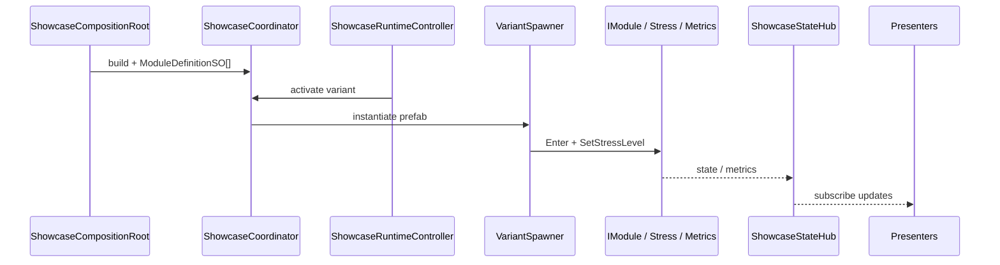
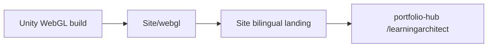
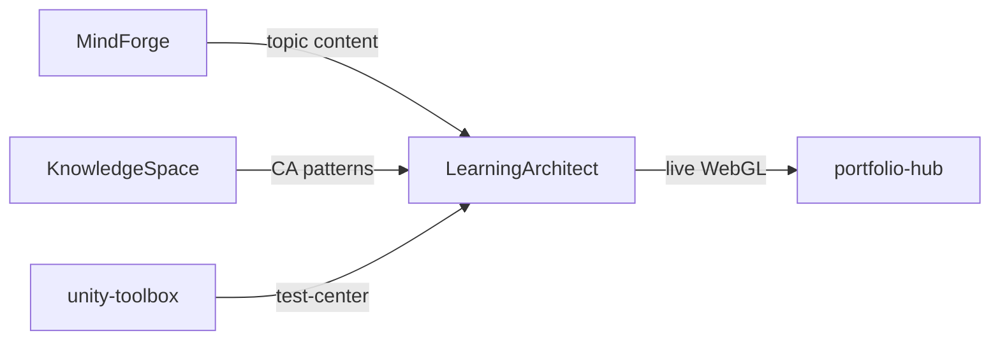

# LearningArchitect — Architecture

**Product names:** LearningArchitect (showcase) · ExtractionRPG (arena / multiplayer loop)  
**Status:** 🟡 Active — Unity showcase + Arena local ✅ · Backend auth/lobby/match (in-memory) ✅ · WebGL deploy ⏳  
**Stack:** Unity 6000 / URP / WebGL · ASP.NET Core · PostgreSQL (+ Redis planned) · static `Site/`  
**Last updated:** 2026-07-18

Product docs live here (`docs/`). Unity runtime detail: [[LearningArchitect/UnityClient/docs/Architecture]].  
Workspace decisions: [[LearningArchitect/docs/Decisions]].

---

## 1. Purpose

Два продукта в одном workspace:

1. **Architecture Showcase** — data-driven hub модулей (pooling, AI, VFX, update loops, …) для демонстрации инженерных решений и интервью.
2. **Interview Arena** — отдельная сцена: locomotion, combat, AI FSM, buffs; путь к online lobby/match через backend.

Публичная витрина: статический `Site/` + embedded WebGL → [[portfolio-hub/docs/projects/learningarchitect]].

---

## 2. Workspace topology

```text
LearningArchitect/                 (git root — product workspace, NOT a Unity project)
├── UnityClient/                   open this in Unity Hub
│   ├── Assets/Content/
│   │   ├── Showcase/              hub shell, localization, ArchitectureShowcase.unity
│   │   └── Modules/               ObjectPooling, AISystem, …, InterviewArena
│   └── docs/                      Unity-specific architecture & Arena docs
├── Backend/src/ExtractionRpg.Api  ASP.NET Core (auth, lobby, match — in-memory MVP)
├── docs/                          product-level (this folder)
├── Site/                          bilingual landing + WebGL host
└── docker-compose.yml             PostgreSQL (+ Redis) for local/dev
```

**D-WS-001:** Unity opens from `UnityClient/`, not repo root — [[LearningArchitect/docs/Decisions]].



---

## 3. Unity client — two shells

### 3.1 Architecture Showcase

| Piece | Role |
|-------|------|
| Scene | `ArchitectureShowcase.unity` |
| Prefab SoT | `ArchitectureShowcaseHub.prefab` (hand-authored; tools validate, don't silently regen) |
| Composition | `ShowcaseCompositionRoot` → `ShowcaseCoordinator` |
| Runtime | `ShowcaseRuntimeController`, `ShowcaseCommandRouter`, `ShowcaseStateHub`, transitions |
| Data | `ModuleDefinitionSO` + `VariantDefinitionSO` (wiring); copy only in Localization tables |

**Module contracts:** `IModule` · `IShowcaseStressTarget` · `IShowcaseMetricsSource`

**Modules (Content):** ObjectPooling · AISystem · EffectsSystem · InventorySystems · LayeredCharacterAnimation · UpdateLoopStrategies · VFXDelivery · **InterviewArena** (separate scene, not only a hub variant).

Deep dive: [[LearningArchitect/UnityClient/docs/Architecture]].



### 3.2 Interview Arena

| Piece | Role |
|-------|------|
| Scene | `InterviewArena.unity` |
| Runtime | Combat, AI, Player, Physics, Pickups, UI, Services |
| Net | `IBackendApiClient` / `UnityWebRequestBackendApiClient` + `BackendApiConfig` SO |
| Online flow | `InterviewArenaOnlineFlowController` (login → lobby → start) |

Local play works offline. Online path talks to Backend — see [[LearningArchitect/docs/ClientServerFlow]] and [[LearningArchitect/docs/ApiContract]].

---

## 4. Backend

**Project:** `Backend/src/ExtractionRpg.Api`

| Area | Status |
|------|--------|
| Health (`/health`, `/health/ready`) | ✅ |
| Auth login-by-name + opaque session token | ✅ (in-memory) |
| Profile `/api/profile/me` | ✅ |
| Lobbies CRUD / join / ready / start | ✅ (in-memory) |
| Match result submit | ✅ (in-memory) |
| PostgreSQL persistence for users/sessions/results | ⏳ |
| Authoritative multiplayer sim / relay | ⏳ TBD |

Trust: WebGL client is **not** final match authority; Backend owns sessions, lobby, results — table in older notes still applies.

---

## 5. Delivery / portfolio



- Build from `UnityClient/`
- Prepare: `Site/prepare-webgl-site.ps1` (see Unity WebDeployment docs)
- Showcase spec: [[portfolio-hub/docs/projects/learningarchitect]] · [[portfolio-hub/docs/PORTFOLIO]]

---

## 6. Cross-project links

| Related | Connection |
|---------|------------|
| [[MindForge/docs/architecture]] | Topics / skills (e.g. unity-runtime) feed interview narrative; no shared runtime |
| [[KnowledgeSpace/docs/04_Architecture]] | Clean Architecture / presentation boundaries — conceptual peer for Unity CA |
| [[unity-toolbox/README]] | Reusable Test Center UPM used across Unity projects |
| [[OurMessendger/docs/architecture]] | Different product; shared lesson: clear client↔API contracts |
| [[BaD_Writer/docs/project-architecture-overview]] | Deferred creative Unity app; patterns may reuse toolbox |
| [[Dashboard]] | Status hub |



---

## 7. Doc checklist

- [x] Product `Architecture.md` with mermaid + Obsidian cross-links
- [x] Sync [[LearningArchitect/docs/ClientServerFlow]] “Current State” with Roadmap (auth/lobby done)
- [ ] Deploy WebGL to HTTPS + footer cross-links (portfolio rollout)
- [ ] Postgres persistence for sessions/results
- [ ] GitHub Project board URL here when created

**Track work:** [[LearningArchitect/docs/Roadmap]] · [[LearningArchitect/docs/SkillsRoadmap]] · `UnityClient/docs/OpenThreads.md`

---

## 8. Reading order

1. **This file** — workspace map  
2. [[LearningArchitect/docs/ClientServerFlow]] — login → lobby → match  
3. [[LearningArchitect/docs/ApiContract]] — HTTP shapes  
4. [[LearningArchitect/docs/Roadmap]] — status  
5. [[LearningArchitect/docs/Decisions]] — durable workspace choices  
6. [[LearningArchitect/UnityClient/docs/Architecture]] — showcase runtime deep dive  
7. Arena: `UnityClient/docs/Modules/InterviewArena/README.md`  
